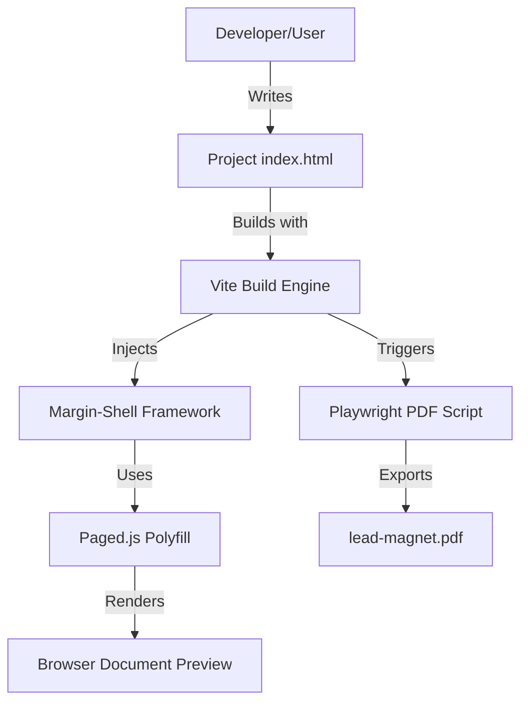

# System Overview: Margin Architecture

## 1. High-Level Flow

## 2. Core Components
### A. The Margin-Shell (`/framework`)
- **`base.css`**: Resets and base @page rules.
- **`components.css`**: Atomic document components (Margins, Bleed, Columns).
- **`margin-ui.js`**: Development-only overlay for page metrics and overflow detection.

### B. Project Structure (`/projects`)
- Each project is a self-contained directory with an `index.html`.
- Uses relative asset paths for portability.
- Optional `theme.json` for token-based styling.

### C. PDF Engine
- Custom Node.js script using Playwright.
- Connects to the local Vite dev server (or static build) to "capture" the paginated output.

## 3. Data Flow
1. **Source**: Developer edits `projects/ebook-01/index.html`.
2. **Preview**: Vite reflects changes in the browser. Paged.js splits content into pages.
3. **Guardrails**: `margin-ui.js` highlights any content that overflows its page container.
4. **Artifact**: On `npm run build`, the PDF script runs and produces the final document in `dist/`.
